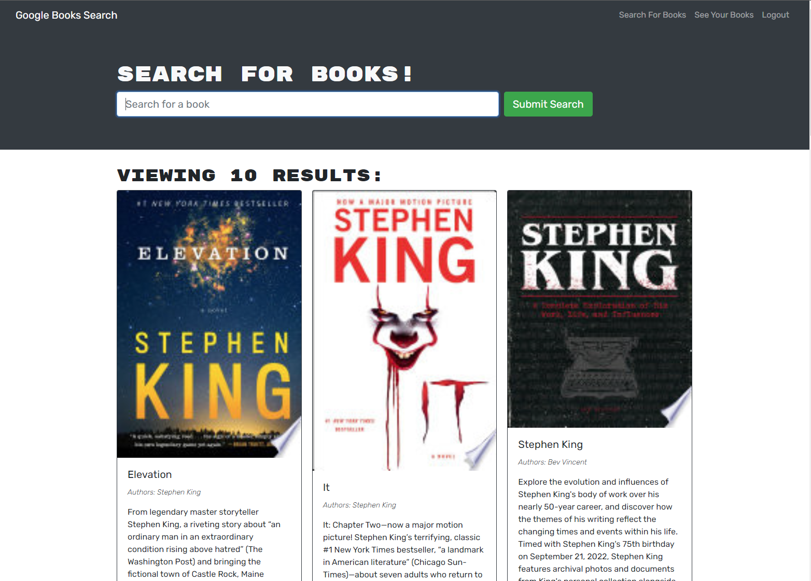

# Google Book Search

This is an API search engine refactored through a MERN stack with React as a front end, MongoDB database, and Express server with GraphQL and Apollo.

[Depoloyed App](https://booksearchturner.herokuapp.com/)

Starting with a allready working app, I refactored it from a RESTful API into the MERN stack and connected it to a MongoDB cloud based database. In this app, users can sign up and search for books through a google api and save them onto their own list. This list is saved in the database so a user can log out and return at another date and find thier saved books.

## Screenshots

### Tools

Here are the tools I used in this project:

- [Apollo Server](https://www.apollographql.com/docs/apollo-server/)
- [MongoDB](https://www.mongodb.com/)
- [GraphQL](https://graphql.org/)
- [React](https://reactjs.org/)